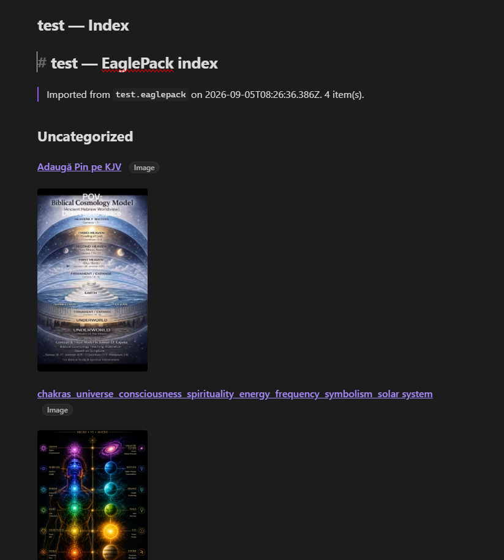
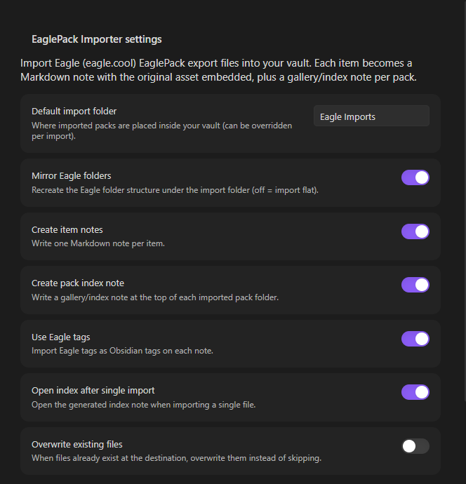
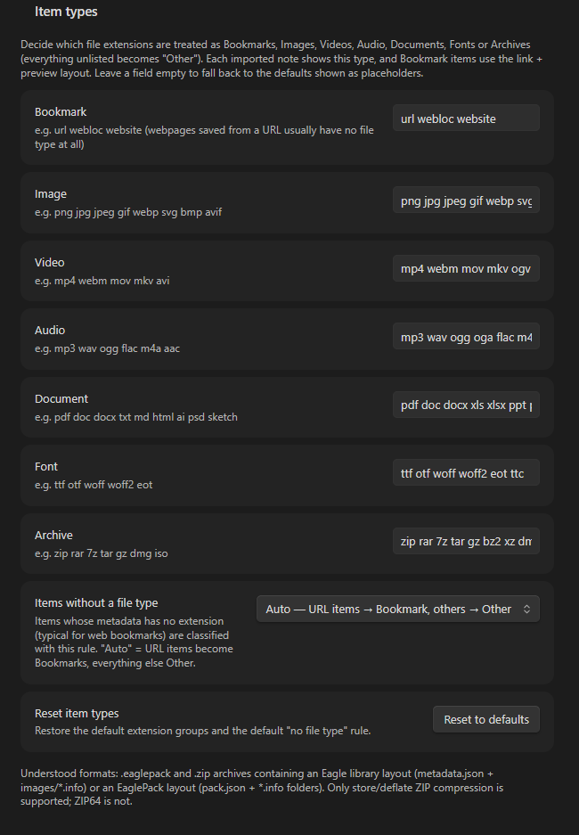

# EaglePack Importer for Obsidian

Import and display [Eagle](https://eagle.cool) (eagle.cool) **EaglePack** export files (`.eaglepack`) inside Obsidian — **single file** or **batch** mode.

Each imported item becomes a Markdown note that **embeds the original image** and shows the Eagle metadata (name, tags, folders, source URL, annotation, star rating, dimensions, colour palette). A pack-level **index / gallery note** is generated for browsing, and Eagle folder structure can be mirrored as real vault folders.

> **Short version:** put this folder into `<your vault>/.obsidian/plugins/eaglepack-importer/`, enable the plugin, then run
> **`EaglePack Importer: Import EaglePack… (single file)`** or **`… (batch)`** from the command palette.

---

## Screenshots







---

## What is an EaglePack?

`.eaglepack` is Eagle's "素材包 / material pack" export format — a ZIP archive that carries items (images, videos, fonts, design files…) plus their metadata. The same container format is produced when you export selected items from Eagle, and free packs from the Eagle community (`eagle.cool/resources`) ship as `.eaglepack` files. The plugin also accepts plain `.zip` archives of an Eagle `.library` folder, so you can import a whole library export as well.

Two internal layouts are understood automatically (including archives nested under an arbitrary top-level folder):

| Layout | Typical contents |
| --- | --- |
| **Library layout** (zipped `.library`) | `metadata.json` (folder tree) · `mtime.json` · `images/<ITEM_ID>.info/metadata.json` + assets |
| **Pack layout** (`.eaglepack`) | `pack.json` (`{ "images": [...] }`) · `<ITEM_ID>.info/metadata.json` + assets |

Item folders inside Eagle are named `<ITEM_ID>.info` and hold a `metadata.json` beside the original file and (optionally) a `_thumbnail.png` preview — see [docs/FORMAT.md](docs/FORMAT.md) for the full reverse-engineered layout.

---

## Features

- **Single & batch import** — pick one `.eaglepack`/`.zip` file, or multi-select several at once.
- **Embedded previews** — images/videos/audio/PDFs are embedded in the notes with Obsidian's native `![[…]]` embeds, so they render in Reading/Live Preview and mobile.
- **Item type classification** — Settings lets you decide which file extensions count as Bookmark / Image / Video / Audio / Document / Font / Archive (everything unlisted is Other) and what to do with items that have no file type. The note's `Type` field and the Bookmark link+preview layout follow this classification. Items saved from a URL are classified as **Bookmark** by default even when their file type is unknown or unlisted — only an explicit group mapping overrides that.
- **Type badges next to titles** — the item's type is displayed as a small badge right beside its title, both at the top of each item note and on every title row of the gallery/index note.
- **Bookmark items** — webpages/URLs saved in Eagle (metadata with a source `url` and no original file) get a clickable 🔗 source link with their preview thumbnail displayed below the link.
- **Per-item notes** — YAML frontmatter keeps structured data (Eagle id, name, ext, size, dimensions, star rating, URL, btime, annotation, folder paths, original tags), so it stays queryable (e.g. with Dataview).
- **Folder mirroring** — Eagle's folder tree is recreated as vault folders (toggleable; flat import otherwise).
- **Gallery/index note** per pack, grouped by folder, each row = thumbnail embed + link to the item note.
- **Tags** — Eagle tags are converted into Obsidian tags on the imported notes (spaces → `-`, `#`/`/` stripped, Unicode preserved).
- **Safe re-import** — existing files are skipped by default; an *Overwrite* toggle is available.
- **No dependencies** — pure-JS ZIP parser (store + DEFLATE via the platform `DecompressionStream`); nothing to build or install.
- **Preview before import** — a dialog summarizes each file (item counts, parser warnings) with per-run options before anything is written.

## Installation

### Manual (no build step needed)

1. Copy this folder (`eaglepack-importer`) into `<your vault>/.obsidian/plugins/eaglepack-importer/` so that `main.js` and `manifest.json` sit directly inside that folder.
2. In Obsidian open **Settings → Community plugins**, click **Reload plugins** if needed, and toggle **EaglePack Importer** on.
3. If the plugin is not listed, restart Obsidian once.

### Development

There is no TypeScript/build toolchain — `main.js` is plain, dependency-free JavaScript.

```bash
npm test          # runs tests/run.mjs (Node ≥ 18; DecompressionStream required)
```

## Usage

1. Run one of the two commands (or click the ↓ ribbon icon):
   - **`EaglePack Importer: Import EaglePack… (single file)`**
   - **`EaglePack Importer: Import EaglePacks… (batch)`**
2. Select your `.eaglepack` (or `.zip`) file(s).
3. Review the import dialog (destination folder, mirror folders, item notes, index note, tags, overwrite) and click **Import**.
4. Done — files land under `Eagle Imports/<Pack Name>/…` (default), a status-bar progress counter runs during import, and a completion notice lists results. For single imports the pack index note opens automatically.

### Resulting structure (example)

```
Eagle Imports/
└── My Eagle Library/                  ← one folder per pack
    ├── My Eagle Library — Index.md    ← gallery/index note
    ├── animal/
    │   └── dog/
    │       ├── photo dog.md           ← item note (embeds image below)
    │       └── photo dog.jpg
    └── video/
        ├── clip.md
        └── clip.mp4
```

An item note looks like:

```markdown
---
eagle:
  id: "MGMYDH18YSIS1"
  name: "pexels-stuart-robinson-…"
  ext: "jpg"
  kind: "image"
  sourcePack: "My Eagle Library"
  importedFrom: "my-library.eaglepack"
  importedAt: "2025-01-01T00:00:00.000Z"
  size: 63785
  dimensions: "640 x 960"
  star: 4
  btime: "2025-08-30T23:04:57.667Z"
  url: "https://example.com/dog"
  annotation: "A lovely dog photo."
  eagleFolders: ["animal / dog"]
  eagleTags: ["Animal", "Bird", "UI Design"]
  asset: "photo dog.jpg"
tags: ["Animal", "Bird", "UI-Design"]
---

# photo dog

![[Eagle Imports/My Eagle Library/animal/dog/photo dog.jpg]]
…
```

Bookmark/webpage items render the source link first and the preview below it:

```markdown
# Web Design Ideas

🔗 [https://example.com/design-inspiration](https://example.com/design-inspiration)

![[Eagle Imports/Links/Web Design Ideas_thumbnail.png]]
```

## Settings

| Setting | Default | Description |
| --- | --- | --- |
| Default import folder | `Eagle Imports` | Vault folder packs are imported into. |
| Mirror Eagle folders | on | Recreate Eagle folder structure; off = flat. |
| Create item notes | on | One `.md` per item. |
| Create pack index note | on | Gallery note at the pack root. |
| Use Eagle tags | on | Eagle tags → Obsidian tags. |
| Open index after single import | on | Auto-open the index when importing one file. |
| Overwrite existing files | off | Skip files that already exist unless enabled. |
| **Item types** — extension groups | — | One editable list per type group (Bookmark, Image, Video, Audio, Document, Font, Archive). Extensions you type there decide each item's `Type` and the Bookmark layout. |
| **Item types** — no file type | Auto | Rule for items whose metadata has no extension: Auto = URL items → Bookmark, else Other; or force one fixed kind. |
| **Item types** — reset | — | Restore the default extension groups. |

## Limitations

- ZIP **store / deflate** compression only; **ZIP64** archives are not supported (rarely produced by Eagle).
- The parser is read-only and memory-safe in practice, but importing very large packs duplicates the assets into your vault — they become regular vault attachments.
- Deleted items (`isDeleted`) are skipped.
- Formats Eagle cannot embed in Obsidian (PSD, AI, fonts, Sketch, …) are imported as attachments and linked from the note with 📎; only images/video/audio/PDF get inline embeds. Eagle-generated `_thumbnail.png` previews are used as the visible asset for items that have no original file (e.g. bookmarks) — and if a bookmark folder also contains a `*.url` shortcut next to the preview, **both** are imported: the preview is embedded and the shortcut is listed under *Attachments* in the note.
- Plugin runs entirely in the vault: nothing is uploaded, no Eagle app is required.

## Tests

`npm test` runs 16 Node tests covering the ZIP reader (store + deflate + UTF-8 names), both Eagle layouts, pack.json-only fallback, folder-tree mirroring, sanitization, and generated note/index markdown. Fixtures are synthesized in `tests/fixtures.mjs`.

## Files

```
manifest.json      plugin metadata
versions.json
main.js            the whole plugin (pure logic + Obsidian UI)
styles.css         small stylesheet (palette swatches)
package.json       metadata + `npm test`
tests/run.mjs      Node test runner
tests/fixtures.mjs synthetic .eaglepack/.zip fixtures
docs/FORMAT.md     reverse-engineered Eagle/EaglePack format notes
LICENSE            MIT
```

## License

MIT © 2026 Kerekes Stefan — see [LICENSE](LICENSE).
